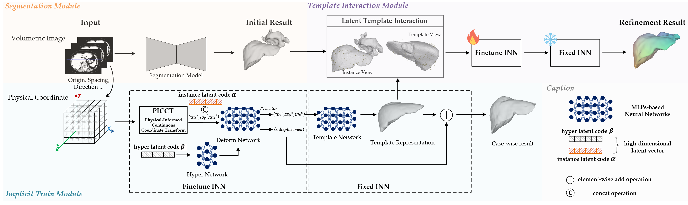

# ISMM: Implicit Shape Modeling for Medical Anatomical Structures

<div align=center></div>

[**_Implicit Shape Modeling for Anatomical Structure Refinement of Volumetric Medical Images_**]()

> By Minghui Zhang, Hanxiao Zhang, Xin You, Guang-Zhong Yang and Yun Gu
>> Institute of Medical Robotics, Shanghai Jiao Tong University

## Introduction
Shape modeling of volumetric medical images is the critical task for quantitative analysis and surgical plan in computer-aided diagnosis. To relieve the burden of expert clinicians, the reconstructed shapes are widely 
acquired from deep learning models, e.g. Convolutional Neural Networks (CNNs), followed by marching cube algorithm. However, automatically obtaining reconstructed shapes can not always achieve perfect results due to the 
limited resolution of images and lack of shape prior constraints. In this paper, we design a unified framework for the refinement of medical image segmentation on top of implicit neural network. Specifically, 
In order to learn sharable shape prior across instances in the training phase, the physical information of volumetric medical images are firstly utilized to construct the Physical-Informed Continuous 
Coordinate Transform (PICCT). PICCT transforms the input data to an aligned manner fed into the implicit shape modeling. To better learn shape representation, we introduce implicit shape constraints on top of signed distance 
function (SDF) into the implicit shape modeling of both instances and latent template. For inference phase, a template interaction module (TIM) is proposed to refine initial results produced by CNNs via deforming deep implicit templates with latent codes.

## Usage
To train and finetune the shape modeling process, please use ```python train.py``` and ```python finetune.py``` with the specified config files.

